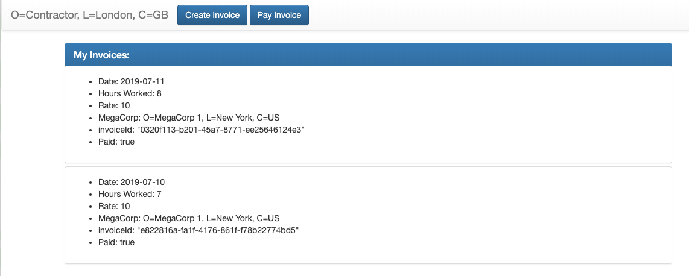

# Corda Timesheet Application

This application demonstrate both LinearState and QueryableState in Corda 4.1.


# Running Corda Nodes

```bash

# compile 
# in root directory
gradle deployNodes


# Running Notary
cd workflows-kotlin/build/nodes/Notary
java -jar corda.jar 


# Running Oracle
cd workflows-kotlin/build/nodes/Oracle 
java -jar corda.jar


# Running Contractor
cd workflows-kotlin/build/nodes/Contractor
java -jar corda.jar

# Running MegaCorp-1 ( You can have multiple billable Companies)
cd workflows-kotlin/build/nodes/MegaCorp 1
java -jar corda.jar

```

#  Running Client API / UI (a.k.a Client RPC)

```bash

# Compile

cd clients
gradle build

# Running Coractor Application Client (Biller)
gradle runContractorServer 

# Running Mega Corp (Company Billable)
gradle runMegaCorp1Server

```

# Pay Attentions 
- Total Billable hours / day is max 10 hours
- For Client UI you can still create jar file and runs them like Corda Application


# Screenshots

